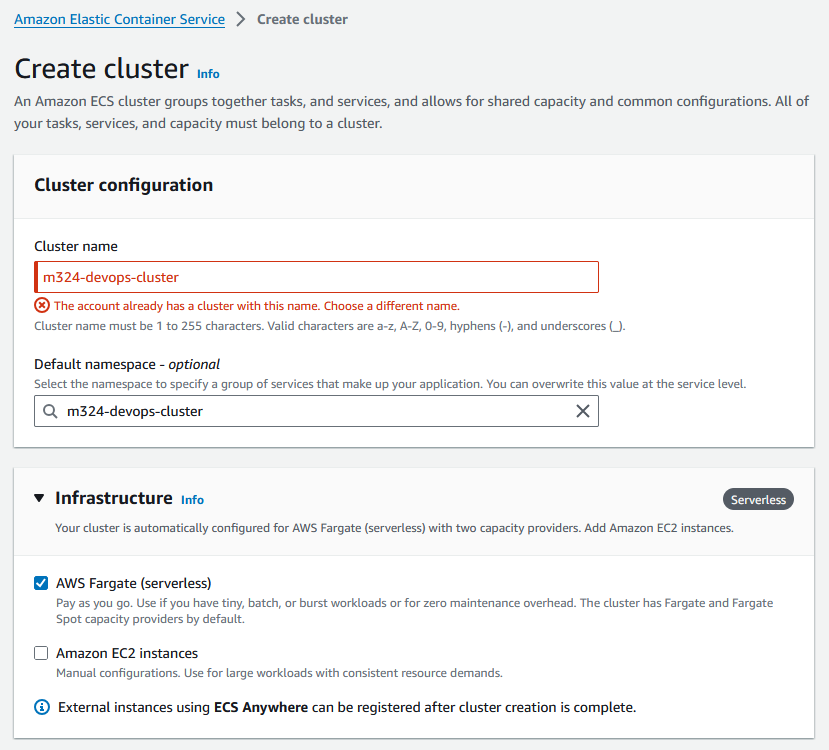

# Architecture Ref.Card 02 - React Application (serverless)

Link zur Übersicht<br/>
https://gitlab.com/bbwrl/m346-ref-card-overview

## Installation der benötigten Werkzeuge

Für das Bauen der App wird Node bzw. npm benötigt. Die Tools sind unter 
der folgenden URL zu finden. Für die meisten Benutzer:innen empfiehlt sich 
die LTS Version.<br/>
https://nodejs.org/en/download/

Node Version Manager<br/>
Für erfahren Benutzer:innen empfiehlt sich die Installation des 
Node Version Manager nvm. Dieses Tool erlaubt das Installiert und das 
Wechseln der Node Version über die Kommandozeile.<br/>
**Achtung: Node darf noch nicht auf dem Computer installiert sein.**<br/>
https://learn2torials.com/a/how-to-install-nvm


## Inbetriebnahme auf eigenem Computer

Projekt herunterladen<br/>
```git clone git@gitlab.com:bbwrl/m346-ref-card-02.git```
<br/>
```cd architecture-refcard-02```

### Projekt bauen und starten
Die Ausführung der Befehle erfolgt im Projektordner

Builden mit Node/npm<br/>
```$ npm install```

Das Projekt wird gebaut und die entsprechenden Dateien unter dem Ordner node_modules gespeichert.

Die App kann nun mit folgendem Befehl gestartet werden<br/>
```$ npm start```

Die App kann nun im Browser unter der URL http://localhost:3000 betrachtet werden.


### Inbetriebnahme mit Docker Container
1. Create Dockerfile 

 ```
FROM node:18-alpine
WORKDIR /app
COPY package*.json ./
RUN npm install
COPY . .
EXPOSE 3000
CMD ["npm", "start"]
```

2. Create the Docker-Image

```
docker build -t  yannickzh/m346-ref-card-02 .
docker push  yannickzh/m346-ref-card-02
```
### Github Actions

1. Create Workflow directory

```
mkdir .github/workflows
```

2. Create workflow files

ci.yaml
```
name: CI

on:
  push:
    branches: [ main ]

jobs:
  build:
    runs-on: ubuntu-latest

    steps:
      - uses: actions/checkout@v3
      - name: Build the Docker image
        run: docker build -t zhyannick/m346-ref-card-02 .
      - name: Login to Docker Hub
        run: docker login -u zhyannick -p  ${{ secrets.DOCKER_PASSWORD }}
      - name: Push the Docker image
        run: docker push zhyannick/m346-ref-card-02
```

deploy.yaml
```

name: Build and Deploy Docker to AWS

on:
  push:
    branches:
      - main

jobs:
  build:
    runs-on: ubuntu-latest

    steps:
      - name: Checkout code
        uses: actions/checkout@v3

      - name: Set up AWS credentials for session
        env:
          AWS_ACCESS_KEY_ID: ${{ secrets.AWS_ACCESS_KEY_ID }}
          AWS_SECRET_ACCESS_KEY: ${{ secrets.AWS_SECRET_ACCESS_KEY }}
          AWS_SESSION_TOKEN: ${{ secrets.AWS_SESSION_TOKEN }}
          AWS_DEFAULT_REGION: ${{ secrets.AWS_REGION }}
        run: |
          aws configure set aws_access_key_id $AWS_ACCESS_KEY_ID
          aws configure set aws_secret_access_key $AWS_SECRET_ACCESS_KEY
          aws configure set aws_session_token $AWS_SESSION_TOKEN
          aws configure set region $AWS_DEFAULT_REGION

      - name: Log in to Amazon ECR
        run: |
          aws ecr get-login-password --region ${{ secrets.AWS_REGION }} | docker login --username AWS --password-stdin ${{ secrets.ECR_REPOSITORY }}

      - name: Build Docker image
        run: docker build -t my-docker-app .

      - name: Tag Docker image
        run: docker tag my-docker-app:latest ${{ secrets.ECR_REPOSITORY }}:latest

      - name: Push Docker image to Amazon ECR
        run: docker push ${{ secrets.ECR_REPOSITORY }}:latest

  deploy:
    needs: build
    runs-on: ubuntu-latest

    steps:
      - name: Set up AWS credentials for session
        env:
          AWS_ACCESS_KEY_ID: ${{ secrets.AWS_ACCESS_KEY_ID }}
          AWS_SECRET_ACCESS_KEY: ${{ secrets.AWS_SECRET_ACCESS_KEY }}
          AWS_SESSION_TOKEN: ${{ secrets.AWS_SESSION_TOKEN }}
          AWS_DEFAULT_REGION: ${{ secrets.AWS_REGION }}
        run: |
          aws configure set aws_access_key_id $AWS_ACCESS_KEY_ID
          aws configure set aws_secret_access_key $AWS_SECRET_ACCESS_KEY
          aws configure set aws_session_token $AWS_SESSION_TOKEN
          aws configure set region $AWS_DEFAULT_REGION


      - name: Update ECS service
        run: |
          aws ecs update-service --cluster ref-card-zhyannick --service ref-card-zhyannick-service --task-definition ref-card-zhyannick
```

3. Add DockerHub Credentials 


# Build and Deploy Docker to AWS

This repository contains a GitHub Actions workflow to automate the process of building a Docker image and deploying it
to an Amazon Web Services (AWS) Elastic Container Registry (ECR) and EC2 instance.

## Workflow Overview

The workflow is triggered on a push to the `main` branch and consists of two main jobs: **build** and **deploy**.

### 1. Build Job

- **Runs on**: `ubuntu-latest`
- **Steps**:
    1. **Checkout Code**: Retrieves the code from the repository.
    2. **Set Up AWS Credentials**: Configures AWS CLI with credentials stored in GitHub Secrets.
    3. **Log in to Amazon ECR**: Authenticates the Docker client to the Amazon ECR service.
    4. **Build Docker Image**: Builds the Docker image from the Dockerfile in the repository.
    5. **Tag Docker Image**: Tags the built Docker image for ECR.
    6. **Push Docker Image to Amazon ECR**: Pushes the tagged Docker image to ECR.
- Afterwards it will be sent to ecr and should look like this:
- Image of dockerhub: 
### 2. Creating an ECS cluster



After creation, you should be able to find the cluster in the list.

### 3. Creating an ECS task definition


For the environment variables, put in the details you already know. For the production environment, there is a JSON file for the task definition, located [here](./.github/aws/task-definition-prod.json). The pipeline will overwrite wrongly configured settings. Make sure tough, that the development task definition is correct.

### 4. Creating an ECS service

After creating the task definition, you can create a service for the task.


As soon as the service is running, you can do the following to make sure that the application is now working correctly.


### 5. Deploy Job

### `needs: build:`
Indicates that this job depends on a previous job named `build` and will only run after it has completed successfully.

### `runs-on: ubuntu-latest:`
Specifies that the job will run in the latest version of an Ubuntu Linux environment provided by GitHub Actions.

### `steps::`
Defines the individual steps that will be executed in this job.

### Step 1: Set up AWS credentials for session:
- **`name:`** A human-readable name for this step, indicating its purpose.
- **`env:`** Sets environment variables that will be available in the `run` command:
    - **`AWS_ACCESS_KEY_ID:`** The access key for your AWS account.
    - **`AWS_SECRET_ACCESS_KEY:`** The secret key for your AWS account.
    - **`AWS_SESSION_TOKEN:`** A session token for temporary AWS credentials.
    - **`AWS_DEFAULT_REGION:`** The default region for AWS services.
- **`run:`** Contains shell commands that configure the AWS CLI:
    ```bash
    aws configure set aws_access_key_id $AWS_ACCESS_KEY_ID
    aws configure set aws_secret_access_key $AWS_SECRET_ACCESS_KEY
    aws configure set aws_session_token $AWS_SESSION_TOKEN
    aws configure set region $AWS_DEFAULT_REGION
    ```
  This sets up the AWS CLI environment to use the specified credentials and region for subsequent commands.

### Step 2: Update ECS service:
- **`name:`** Another human-readable label for this step.
- **`run:`** Contains the command to update an ECS service:
    ```bash
    aws ecs update-service --cluster ref-card-zhyannick --service ref-card-zhyannick-service --task-defi
    ```
  This command is intended to update the specified ECS service within the `ref-card-zhyannick` cluster. However, the command appears to be incomplete, as it ends with `--task-defi`, which should specify the task definition to use for the update.


## Prerequisites

- **AWS Account**: Ensure you have an AWS account with permissions to access ECR and EC2.
- **GitHub Secrets**: Set up the following secrets in your GitHub repository:
    - `AWS_ACCESS_KEY_ID`: Your AWS access key ID.
    - `AWS_SECRET_ACCESS_KEY`: Your AWS secret access key.
    - `AWS_SESSION_TOKEN`: Your AWS session token (if required).
    - `AWS_REGION`: Your desired AWS region (e.g., `us-east-1`).
    - `ECR_REPOSITORY`: The full URI of your ECR repository (
      e.g., `123456789012.dkr.ecr.us-east-1.amazonaws.com/my-docker-app`).
    - `EC2_SSH_PRIVATE_KEY`: Your EC2 instance's private SSH key.

## Deployment Steps

1. Push your changes to the `main` branch.
2. The workflow will automatically trigger, building the Docker image and deploying it to the EC2 instance.

## Important Notes

- Ensure the EC2 instance is running and accessible.
- Modify the `EC2_INSTANCE_DNS` variable in the `deploy` job to reflect your instance's DNS name.
- The workflow assumes the Docker container listens on port 80. Modify the port mapping as needed.

## Troubleshooting

- Check the Actions tab in your GitHub repository for logs and details on any failures.
- Ensure that the IAM role associated with your AWS credentials has the necessary permissions for ECR and EC2 actions.